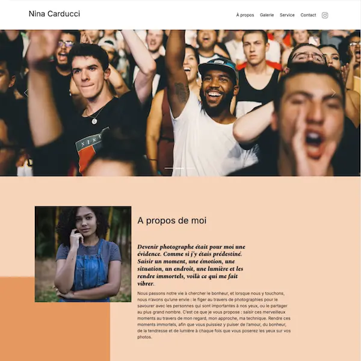

## Nina CARDUCCI - Projet de soutenance n°9 de la formation Développeur Intégrateur Web

J'ai optimisé le référencement d'un site en améliorant sa performance et son accessibilité. J'ai identifié les problèmes, proposé des recommandations et appliqué les améliorations en utilisant des outils tels que Lighthouse et Wave. J'ai créé un rapport illustrant les résultats avant et après les modifications, avec des explications sur les changements apportés et leur impact sur le référencement et l'accessibilité du site.

## Les technologies utilisées

- Les chrome DevTools
- Visual Studio code (débogueur)